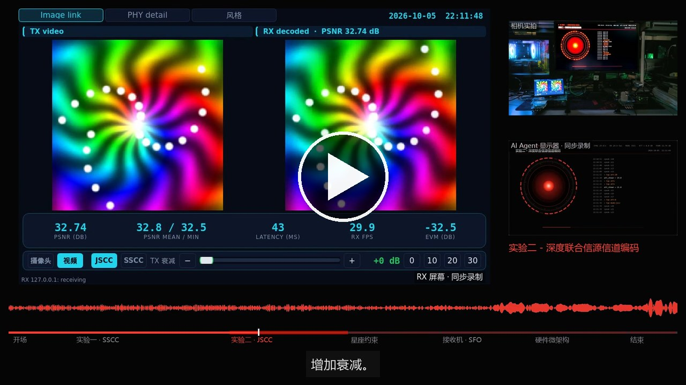
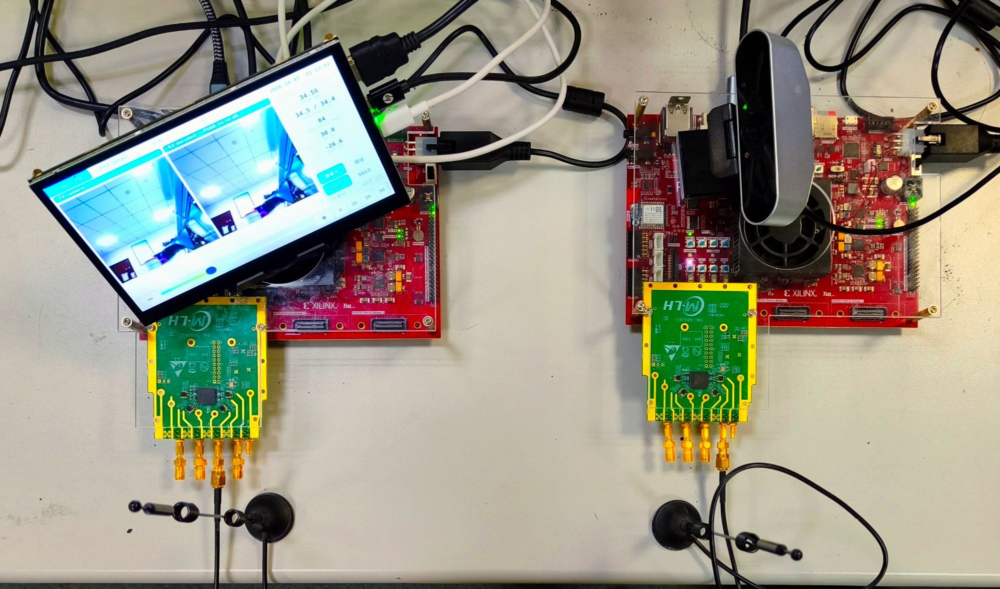
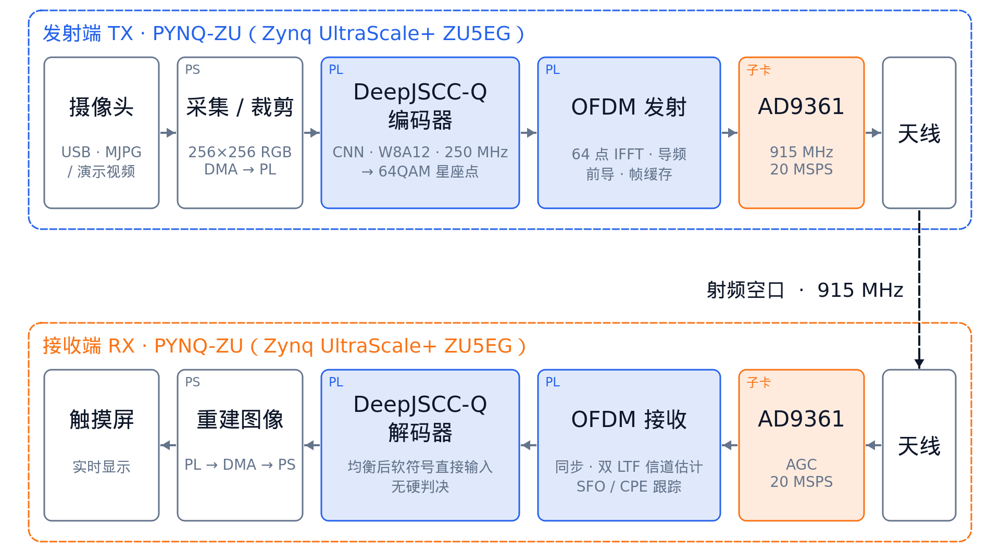
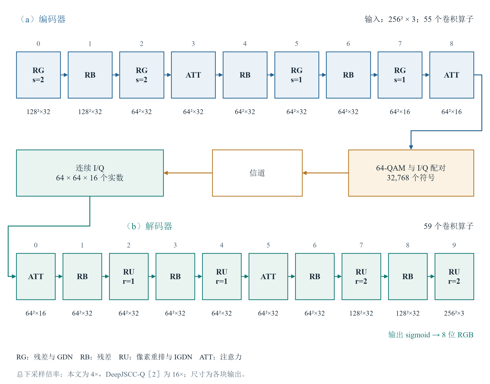
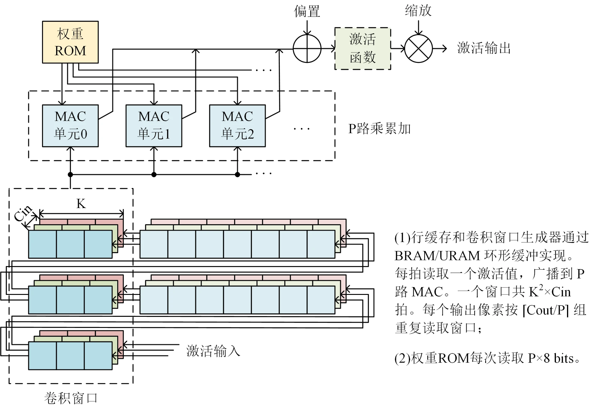
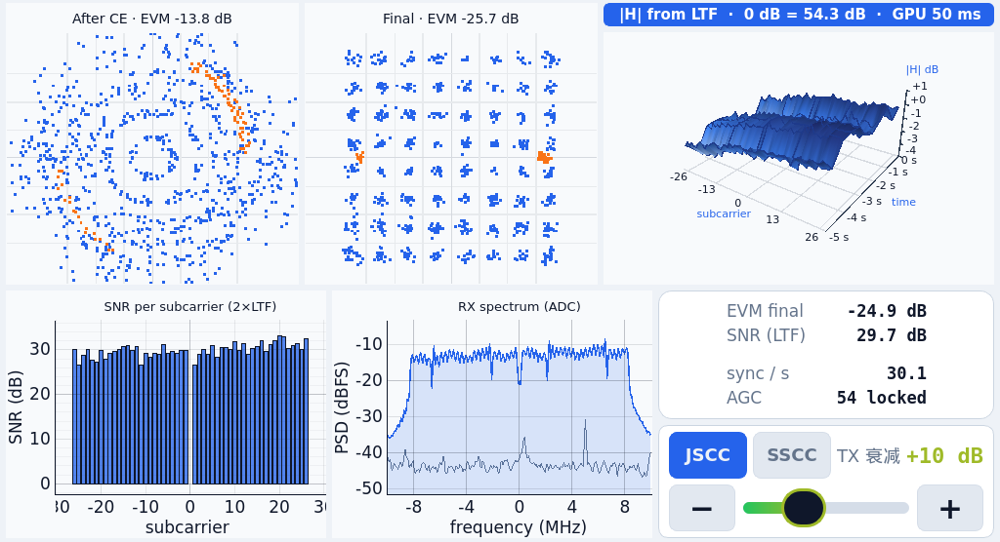
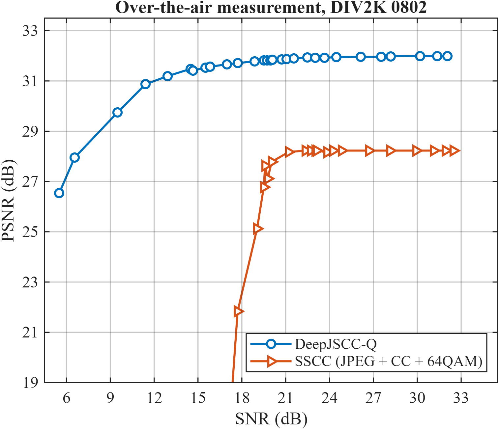
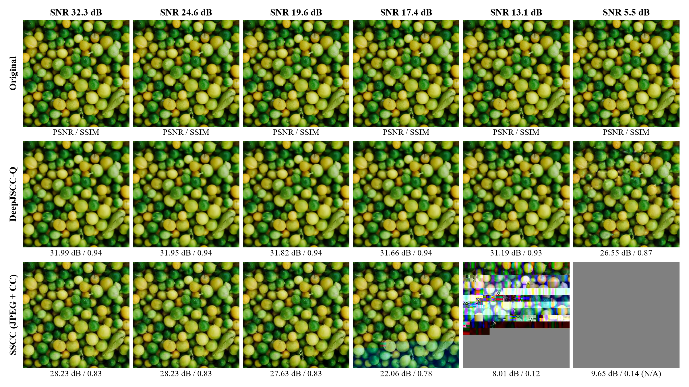
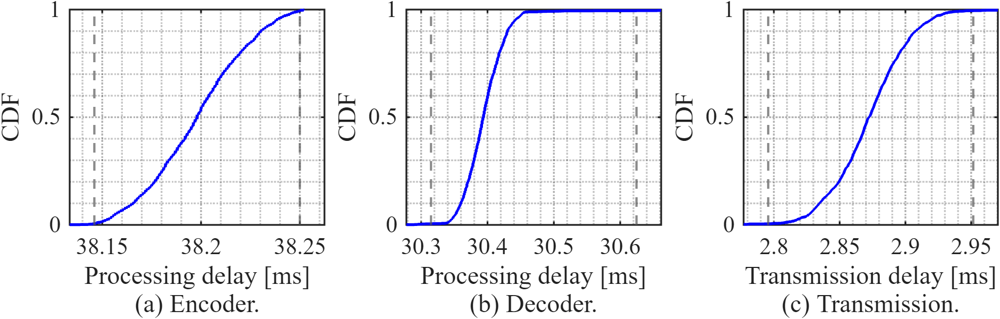

# deepjsccq-ofdm-fpga：基于 FPGA 的 DeepJSCC-Q 实时无线图像传输

两块 PYNQ-ZU（Zynq UltraScale+ xczu5eg）+ 两块 AD9361 射频卡，**深度联合信源信道编码器 / 解码器（DeepJSCC-Q）与类 802.11a OFDM
物理层全部在 PL 中实现**，经 915 MHz 空口以 **30 fps** 实时传输 256×256 彩色图像。信道变差时画质平缓下降，而不是像
"JPEG + 纠错码"那样在某个 SNR 处突然失效。

全国大学生嵌入式芯片与系统设计竞赛 · 2026 FPGA 赛道 · 自主选题（高级组）

<p align="center"><a href="../../releases"></a></p>

**演示视频**（4 分钟，点击图片进入 Release 页面下载）：AI 代理按脚本控制两块板卡完成全部演示，包括系统介绍、
SSCC 与 DeepJSCC-Q 的衰减对比实验、物理层与硬件架构讲解；画面为相机实拍与触摸屏、代理显示器的同步录屏。

---

## 作品简介

**问题**。传统的图像无线传输先压缩（JPEG）、再加纠错码和调制。这种"分离式"设计在信道 SNR 低于纠错码门限时会突然失效
（悬崖效应），SNR 高于门限时，多出来的信道质量又不能转化为画质。DeepJSCC 用一对神经网络把像素直接映射为信道符号，端到端训练，
画质随 SNR 平缓变化；DeepJSCC-Q 进一步把符号约束到 64-QAM 星座上，使它能接入标准的数字物理层。

**本作品**把这条链路完整地做成了实时运行的 FPGA 系统：

| # | 内容 |
|---|---|
| 1 | **全 PL 实现**：DeepJSCC-Q 编码器 / 解码器（W8A12 定点，114 个卷积）与 OFDM 物理层都在 PL 中，PS 只负责取图、显示和控制；30 fps、PL 内单帧时延 71.5 ms |
| 2 | **逐层流式卷积引擎**：每层一个引擎、AXI-Stream 反压串联；按层选择输出通道并行度、共享输入的分支复用读窗、权重按形状放入 LUT / BRAM / 位宽转换器、大激活缓存迁入 URAM。名义计算量是同类 FPGA 实现 [3] 的 10.5 倍，DSP 与 BRAM 用量仍明显更少 |
| 3 | **面向长帧软符号的 OFDM 接收机**：一幅图 = 683 个 OFDM 符号；双 LTF 信道估计、逐符号 SFO 二阶跟踪，帧尾 EVM 只比帧头差约 1.7 dB；均衡后的连续 I/Q 直接送入解码器，不做硬判决；PN 符号翻转把网络输出的 PAPR 拉回随机 QAM 水平 |
| 4 | **射频前端联调**：AD9361 由 PS 初始化；定位并修复 SSCC 高 PAPR 触发 ADC 过载、使 AGC 帧内解锁的问题（锁定电平 −12 → −14 dBFS）；不依赖 RSSI 门限的 AGC 看门狗 |
| 5 | **同 PHY 空口对比**：SSCC 基线（JPEG + K=7 卷积码 + 64-QAM）与 DeepJSCC-Q 共用同一物理层、同星座电平与 TX 衰减、每幅图同样 32,768 个符号 |

## 主要结果（实测，空口）

| 指标 | 结果 | 数据 |
|---|---|---|
| PSNR–SNR（DIV2K 0802） | DeepJSCC-Q：SNR 32 dB 时 32.0 dB，5.5 dB 时仍有 26.5 dB，平缓退化；SSCC 最高 28.2 dB，在 SNR 约 17–20 dB 处悬崖式失效 | `data/measurements/psnr_snr/` |
| 帧率 | 30 fps：连续 600 s 收到 18000 帧 | `data/measurements/fps/` |
| 时延（PL 计数器，中位数） | 编码 38.20 ms / 传输 2.87 ms / 解码 30.39 ms，合计 71.47 ms | `data/measurements/latency/` |
| 资源 / 时序（xczu5eg，布局布线后） | TX：LUT 52,666（45 %）、BRAM36 104.5（73 %）、URAM 10、DSP 243，WNS +0.151 ns；RX：LUT 70,768（60 %）、BRAM36 123.5（86 %）、URAM 25、DSP 394，WNS +0.234 ns | `build/reports/` |
| 功耗（Vivado 估算） | 片上合计 TX 4.49 W / RX 4.94 W，其中 PS 各 2.73 W | `build/reports/*_power.rpt` |
| 网络精度 | W8A12 定点比浮点低 0.05 dB（DIV2K）；RTL 与整数参考模型逐比特一致 | `data/model/`、`sim/network/` |

---

## 系统组成

<p align="center"></p>

左：接收板（PYNQ-ZU + AD9361 + 1024×600 触摸屏）；右：发射板（PYNQ-ZU + AD9361 + USB 摄像头）；前方为 915 MHz 天线。
编码后的图像只经射频空口传输，板间网线仅用于控制和发送原图预览（GUI 计算 PSNR 用）。

<p align="center"></p>

| 参数 | 值 |
|---|---|
| 帧 | 一帧 = 一幅 256×256×3 图 = 32,768 个 64-QAM 符号 = 683 个 OFDM 符号；前导 320 + 683×80 = 54,960 个采样 = 2.748 ms |
| 物理层 | 64 点 FFT，CP 16，48 个数据子载波 + 4 个导频，20 MSPS，915 MHz |
| 网络 | 编码器 55 个、解码器 59 个卷积；387k 参数；名义卷积工作量 0.913 + 1.417 = 2.33 GMAC/帧；每像素 0.5 个复符号 |
| 时钟 | 网络 250 MHz，物理层 100 MHz，二者之间只经过 Gray 码指针的异步 FIFO |

## 关键设计

### DeepJSCC-Q 模型

按 Tung 等人 DeepJSCC-Q（IEEE JSAIT 2022）的期刊版结构实现：编码器由残差块（GDN）、注意力块组成，输出 64×64×16 的潜变量，
相邻通道配成 I/Q，量化到 64-QAM 星座；解码器以 PixelShuffle 上采样（IGDN）还原图像。主通道数 C = 32、总下采样 4 倍。
在 10 dB AWGN 下训练，训练目标加入星座熵（KL）约束，使各星座点使用均衡；训练后量化为 8 位权重、12 位激活。

<p align="center"></p>

### 逐层流式卷积引擎

每个卷积层是一个独立引擎：行缓存只存 K−1 行，窗口元素广播到 P 路 MAC，输出通道分组重读窗口，结果经偏置、激活、重定标后流向下一层。
并行度 P 按"满足 30 fps 的最小值"逐层选择；GDN 用迭代平方根与除法，sigmoid 用 32 段分段线性。

<p align="center"></p>

| 优化（编码器 / 解码器） | 优化前 | 优化后 |
|---|---|---|
| 按层选择并行度：MAC 通路之和 | 1120 / 1191（统一并行度） | 217 / 296 |
| 权重位宽转换器：编码器乘累加 DSP / 权重 BRAM36 | 255 / 42.0 | 223 / 38.0 |
| 大激活缓存迁入 URAM：BRAM36（规划值） | 114.0 / 149.0 | 97.5 / 99.5 |

### OFDM 物理层与射频前端

- **PN 符号翻转**：网络输出沿 NHWC 顺序相关，直接上子载波会使 PAPR 升高 1–2 dB；TX / RX 用 802.11 扰码多项式对 I、Q 分别翻转符号，
  99 % 分位 PAPR 由 10.1–10.7 dB 降到 9.4–9.8 dB，约 20 个 LUT。
- **长帧同步**：STF 检测与 CFO 估计、LTF 定时（门限 0.375，移位加法实现）、双 LTF 平均信道估计、逐符号 SFO 二阶跟踪与 CPE 归一化。
  物理层单独测试（PRBS 源）7.15×10⁸ 个比特 0 误码、0 丢帧。
- **帧缓存**：TX 在 DAC 前、RX 在均衡后各放一个 URAM 整帧缓存，网络与物理层之间全程反压。
- **AD9361**：修正 SPI 握手、TX 正交校准相位扫描、重新设计 FIR 后，单板环回 EVM 由 −22 dB 提高到 −32 dB；RX 由 PS 初始化，
  快速 AGC 配合"同步率 + 增益"看门狗。

<p align="center"></p>

接收端触摸屏 GUI 的 PHY 页（实时）：信道估计后与最终星座、|H| 随时间变化（Mali-400 GPU 渲染）、逐子载波 SNR、ADC 频谱。

## 实测结果

### 平缓退化 vs. 悬崖效应

<p align="center"></p>

同一物理层、每幅图同样 32,768 个符号：DeepJSCC-Q 从 SNR 32 dB 到 5.5 dB 只下降 5.5 dB；SSCC 在 SNR 约 20 → 17 dB 的 3 dB 区间内
从 27.8 dB 跌到无法解码。高 SNR 时 DeepJSCC-Q 也比 SSCC 高 3.8 dB。横轴为由接收星座与已知参考计算的数据辅助 SNR。

<p align="center"></p>

上：原图；中：DeepJSCC-Q；下：SSCC。列为同一次衰减扫描中 SNR 递减的各点，图下为 PSNR / SSIM；SSCC 无法解码的帧按中灰图计分。

### 时延与帧率

<p align="center"></p>

两块板的 PS 轮询 PL 帧计数器、按数据流逐帧配对得到的分段时延（中位数）：编码 38.20 ms、传输 2.87 ms（下限 2.748 ms 即一帧的空中时间）、
解码 30.39 ms。连续 600 s 收到 18000 帧，平均 30.0 fps。

### 与 FPGA DeepJSCC [3] 的对比

| | Isobe 等 [3]（GLOBECOM 2025） | 本作品 |
|---|---|---|
| 网络 | 5 层卷积 / 5 层转置卷积 | DeepJSCC-Q，55 / 59 个卷积（残差、GDN、注意力） |
| 名义卷积工作量 | 0.22 GMAC/帧 | 2.33 GMAC/帧 |
| DSP（编码 / 解码） | 1597 / 874 | 233 / 312 |
| BRAM（编码 / 解码） | 1038.5 / 1011.5 | 100 / 100（另用 URAM 4 / 18） |
| 时延（编码 / 解码） | 39.6 / 52.9 ms（含 PS 处理） | 38.2 / 30.4 ms（PL） |
| 物理层 | 外部 5G 系统 | 自研 OFDM，同在 PL |

器件、数值精度和测量边界不同，上表只列各自条件下的绝对数值，不是严格的同条件对比（详见设计报告 4.5 节）。

---

## 文档

| 文档 | 内容 |
|---|---|
| [`report/design_report.md`](report/design_report.md) | 设计报告：背景与创新点、原理框图、软硬件划分、优化前后对比与实测、大模型协作、技能包、复现说明 |
| [`report/poster/`](report/poster/) | 英文海报（A0） |
| [`report/llm_collab/`](report/llm_collab/) | 大模型协作记录：17 个典型案例、Claude Code 与 Codex 的协作材料、脱敏的会话转写 |
| [`skill/`](skill/) | 7 个技能（PYNQ DMA 复位、UVC 摄像头、触摸屏补救、离屏渲染、SDR 杂散排查、AD9361 与 AGC、PL 计数器测时延）与 25 条踩坑清单 |
| [`report/notes/`](report/notes/) | 开发过程记录：AD9361 调试、PHY 与网络对接、AGC |
| [`THIRD_PARTY.md`](THIRD_PARTY.md) | 第三方内容与来源 |

## 目录

| 目录 | 内容 |
|---|---|
| `src/hw/tx`、`src/hw/rx` | 两块板的 PL 设计：`rtl/`（`network/` 编解码器、`phy/` OFDM 与 AD9361 接口、`ps/` 寄存器与 DMA 接口、`top/`）、`constr/`、`ip/*.xci`、`bd/`（PS 块设计脚本）、`files.txt`（部署版工程的源文件清单） |
| `src/network` | 网络 RTL 生成器：从量化参数生成各层顶层与权重初始化文件（`gen_rtl_top.py`、`gen_rtl_init.py`、`memory_plan.py`、`tools_create_vivado_projects.py`），`syn/` 卷积引擎 OOC 综合 |
| `src/model` | DeepJSCC-Q 模型、训练、训练后量化（W8A12）与整数参考模型、导出、OFDM 链路评估（见 `src/model/README.md`） |
| `src/sw` | 板上软件：`tx/`（取图、编码器驱动、衰减控制）、`rx/`（接收服务、AD9361 初始化与 AGC 看门狗、GUI）、`common/`（UDP 协议、SSCC 包格式）、`systemd/`、`tools/`、`board_setup/`（可选：GUI 的 PyQt5 与 Mali-400 lima 驱动） |
| `sim` | `network/` 编解码器 RTL 与整数参考模型比特精确比对；`phy/` OFDM 基带；`sscc/` SSCC 基线（见 `sim/README.md`） |
| `build` | 一键构建脚本 `build_hw.tcl`（从本仓库重建的结果与部署版资源、时序完全一致）；`reports/` 资源、时序、功耗报告，`reports/network/` 网络核 OOC 报告 |
| `board` | `bitstreams/` 部署版比特流（含 SHA-256）；`tests/` 板上测量与诊断脚本 |
| `data` | `model/` 部署模型的检查点（`checkpoint/`）、量化后的权重与 RTL 初始化数据；`measurements/` 实测数据与图 |
| `report` | 设计报告、海报、开发记录与大模型协作记录 |
| `skill` | 技能包 |

## 硬件

- 2 × PYNQ-ZU（xczu5eg-sfvc784-2-e），PYNQ 镜像（Python venv `/etc/profile.d/pynq_venv.sh`）
- 2 × AD-FMCOMMS3-EBZ（AD9361），LVDS 1R1T，FDD，915 MHz，参考时钟 40 MHz
- TX：USB UVC 摄像头（可选）；RX：1024×600 触摸屏（DisplayPort）
- 网络：PC ↔ RX 板 `192.168.3.1`；RX ↔ TX 板间网线，TX `192.168.4.1`、RX 侧 `192.168.4.2`

## 快速上手（使用部署版比特流）

1. 把 `board/bitstreams/jscc_tx.{bit,hwh}` 和 `src/sw/tx/*`、`src/sw/common/*` 拷到 TX 板 `/home/xilinx/claude/tx/`；
   `board/bitstreams/jscc_rx.{bit,hwh}` 和 `src/sw/rx/*`、`src/sw/common/*` 拷到 RX 板 `/home/xilinx/claude/rx/`。
   （比特流、`.hwh` 与 Python 程序放在同一目录；其他路径需同步修改 `src/sw/systemd/*.service`。）
2. TX 板 `media/`：演示视频 `src/sw/tx/media/colorful_256.mp4`（默认 `--video`）；预设图由 `src/sw/tools/make_presets.py` 从 DIV2K 生成到 `media/presets/`。
3. 安装服务：`src/sw/systemd/*.service` 拷到 `/etc/systemd/system/`，`systemctl enable --now jscc-tx`（TX）、
   `jscc-rx jscc-gui`（RX）。上电约 1 分钟后触摸屏显示 GUI。
4. 板上程序以 root 运行；`rx_server.py` 启动时下载比特流并由 PS 初始化 AD9361（约 25 s）。

## 从源码重新构建比特流

```
vivado -mode batch -source build/build_hw.tcl -tclargs tx 8
vivado -mode batch -source build/build_hw.tcl -tclargs rx 8
```

在 `build/work/<tx|rx>` 新建工程、按 `src/hw/<side>/files.txt` 加入源文件与 IP、用 `bd/` 脚本生成 PS 块设计，
默认策略综合 / 实现，输出 `build/out/jscc_<side>.{bit,hwh}` 与资源 / 时序 / 功耗报告。工具：Vivado 2025.2。

## 从模型重新生成网络 RTL

`src/model/export_fpga.py` 导出量化参数（`data/model/params`、`rtl_init`、`manifest.json`）→ `src/network/gen_rtl_init.py`、
`gen_rtl_top.py` 生成各层 RTL 与初始化文件 → `tools_create_vivado_projects.py` 把权重文件路径展平为文件名
（`rtl_init__<layer>__<name>.mem`）→ 即 `src/hw/{tx,rx}/rtl/network/` 中的文件。训练与量化流程见 `src/model/README.md`。

## 实测方法

见 `board/tests/` 各脚本开头的说明：`measure_link.py`（PSNR / SNR / EVM 扫描，先到最大衰减再逐点降低）、
`analyze_const.py`（固定图像下以参考星座计算数据辅助 SNR）、`pl_events.py` + `seg_latency.py`（两板 PS 轮询 PL
帧计数器，按数据流配对计算分段时延）、`plot_*.m`（MATLAB 出图）。

## 参考文献

1. E. Bourtsoulatze, D. B. Kurka, D. Gündüz, "Deep joint source-channel coding for wireless image transmission," *IEEE TCCN*, 2019.
2. T.-Y. Tung, D. B. Kurka, M. Jankowski, D. Gündüz, "DeepJSCC-Q: Constellation constrained deep joint source-channel coding," *IEEE JSAIT*, 2022.
3. T. Isobe et al., "FPGA-based deep joint source-channel coding for real-time 5G image transmission," *IEEE GLOBECOM*, 2025.

## 许可

MIT，见 `LICENSE`；第三方内容见 `THIRD_PARTY.md`。
