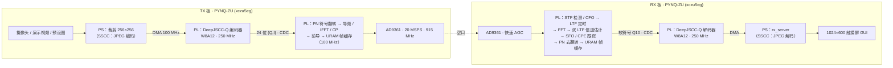
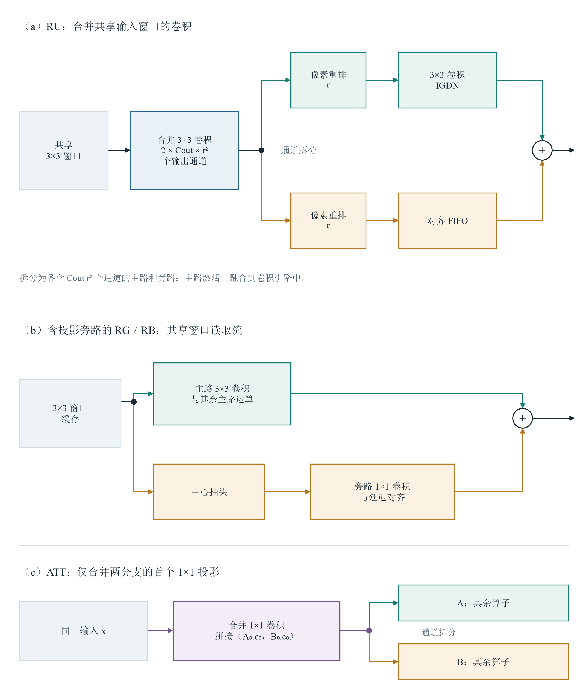
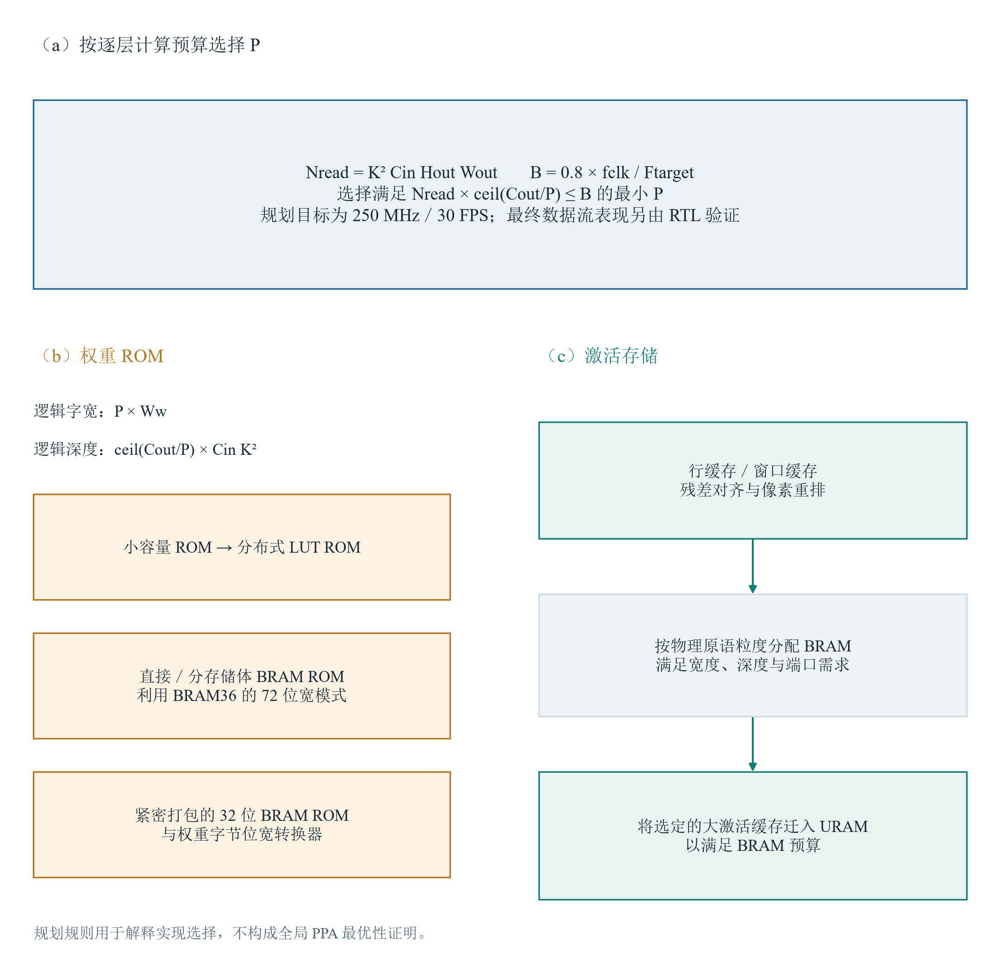
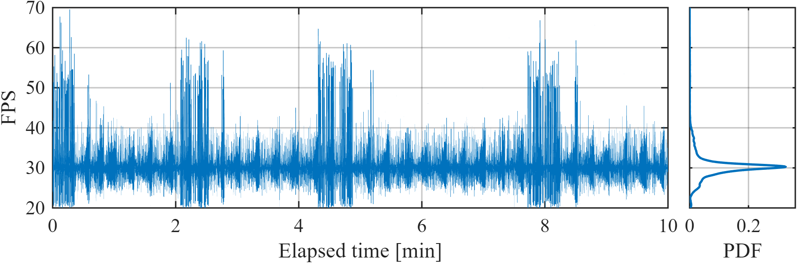

# 基于 FPGA 的 DeepJSCC-Q 实时无线图像传输系统 · 设计报告

全国大学生嵌入式芯片与系统设计竞赛 · 2026 FPGA 赛道 · 自主选题（高级组）

> 本文按选题指南 3.3.5.3 的 7 个部分组织。文中数值的出处：资源 / 时序 / 功耗见 `build/reports/`，
> 仿真见 `sim/`，空口实测见 `data/measurements/`，测量脚本见 `board/tests/`。物理层 / 射频调试阶段（2.3、2.4、4.2 节）
> 的部分数值来自开发过程记录 `report/notes/`（原始抓取数据体积大，未入库）。

---

## 1. 背景与创新点

### 1.1 问题

无线图像传输的传统做法是分离信源信道编码（SSCC）：先用 JPEG 等压缩，再加纠错码和调制。分离设计在码长无限、
信道已知时是最优的，但在实际短帧、信道变化的场景里有两个问题：

- **悬崖效应**：信道 SNR 低于纠错码的门限后，比特错误使熵编码码流失步，整幅图无法解码，画质从"好"直接掉到"无"；
  SNR 高于门限时，多出来的信道质量又不能转化为画质。
- **工作点匹配**：压缩率、码率、调制阶数需要按信道预先选好，信道一变就失配。

深度联合信源信道编码（DeepJSCC）用一对神经网络把图像直接映射为信道符号、再从带噪符号重建图像，端到端训练，
画质随 SNR 平缓变化 [1]。DeepJSCC-Q [2] 进一步把编码器输出约束到有限的 QAM 星座上，使其能接入现有的数字调制
物理层。但要让它在真实射频链路上**实时**运行，还要解决：

1. 网络计算量大（编码、解码分别部署在一块 ZU5EG 上，两端名义卷积工作量合计 2.33 GMAC/帧），要在 PL 中以 30 fps 运行，资源和时序都很紧；
2. DeepJSCC 的接收端需要连续的软符号，不能像比特链路那样先判决再纠错——物理层的同步、均衡误差直接进入解码器；
3. 一幅图对应 32768 个符号，即 683 个 OFDM 符号的长帧，采样频偏（SFO）在帧尾累积的相位已超过 64QAM 的判决余量；
4. 射频前端（AD9361 快速 AGC）在信号变化时的行为会直接造成整帧失败。

### 1.2 相关工作

- Bourtsoulatze 等 [1] 提出 DeepJSCC，Tung 等 [2] 提出 DeepJSCC-Q（有限星座约束 + 软量化训练）。本设计的模型结构、
  训练目标按 [2] 的期刊版本实现。
- Isobe 等 [3]（GLOBECOM 2025）实现了基于 FPGA 的 DeepJSCC 并接入 5G 系统：五层卷积 / 五层转置卷积，INT8，HLS，
  ZCU111，约 33 fps。它是目前与本设计最接近的公开工作，第 4.5 节给出对比及口径说明。

### 1.3 本设计的工作与创新点

| # | 内容 | 对应章节 |
|---|---|---|
| 1 | **完整的 PL 实现**：DeepJSCC-Q 编码器、解码器（W8A12）与类 802.11a OFDM 物理层全部在 PL 中实现，经 915 MHz 空口以 30 fps 实时传输 256×256 彩色图像（连续 600 s 收到 18000 帧）；PS 只负责取图、显示与控制 | 2、3、4.4 |
| 2 | **逐层流式卷积引擎**：114 个卷积算子经分支合并映射为 106 个独立卷积引擎（编码、解码各 53 个），流水连接，按层计算量选择输出通道并行度，分支输入复用，权重 / 激活按尺寸映射到 LUT / BRAM / URAM；DSP 与 BRAM 用量远低于 [3]，而名义工作量是 [3] 的 10.5 倍 | 2.2、4.1 |
| 3 | **面向长帧软符号的 OFDM 接收机**：双 LTF 信道估计、逐 OFDM 符号的 SFO 二阶跟踪与 CPE / 幅度归一化，帧尾 EVM 与帧头相差约 1.7 dB；均衡后的连续 I/Q 直接送入解码器（不做硬判决）；PN 符号翻转把网络输出的 PAPR 拉回随机 QAM 水平 | 2.3 |
| 4 | **星座约束与射频前端的联合考虑**：实测 DeepJSCC-Q 发射波形的 PAPR 尾部比 SSCC 低约 0.8 dB（可能与星座熵约束有关，未单独消融）；我们定位并修复了 SSCC 在悬崖区附近因 ADC 过载导致 AGC 帧内解锁的问题（AGC 锁定电平 −12 → −14 dBFS），并设计了依据同步率与增益状态、不依赖 RSSI 绝对门限的 AGC 看门狗 | 2.4、4.2 |
| 5 | **同 PHY、同星座电平与 TX 衰减、同符号数的空口对比**：SSCC 基线（JPEG + K=7 卷积码 + 64QAM）与 DeepJSCC-Q 共用同一物理层，每幅图同样 32768 个符号；实测 DeepJSCC-Q 平缓退化，SSCC 在 SNR 约 17–20 dB 处悬崖式失效 | 2.5、4.4 |

---

## 2. 系统原理与框图

### 2.1 系统总框图



图 1　系统数据流。网络时钟 250 MHz，PHY 时钟 100 MHz，二者之间只经过 Gray 码指针的异步 FIFO。

| 参数 | 值 |
|---|---|
| 平台 | 2 × PYNQ-ZU（xczu5eg-sfvc784-2-e）+ 2 × AD-FMCOMMS3-EBZ（AD9361），LVDS 1R1T，FDD |
| 射频 | 915 MHz，20 MSPS，TX 衰减 4 dB 起（另加可调额外衰减），参考时钟 40 MHz |
| 帧 | 一帧 = 一幅 256×256×3 图 = 32768 个 64QAM 符号 = 683 个 OFDM 符号；前导 320 + 683×80 = 54960 个采样 = 2.748 ms |
| 网络 | 编码器 55 个、解码器 59 个卷积算子；名义卷积工作量 0.913 + 1.417 = 2.33 GMAC/帧；W8A12 |
| 带宽比 | 每像素 0.5 个复符号（spp），即每个实数像素分量 1/6 个复符号 |
| 帧率 | 30 fps（编码器节奏决定，空口占空比约 8 %） |

### 2.2 DeepJSCC-Q 模型与网络硬件

> 本节与 4.1 节由 Codex 起草、Claude Code 核对合稿（见第 5 节）。

**模型与训练。** 网络将图像直接映射为有限星座上的复数符号，接收端根据均衡后的连续 I/Q 重构图像。部署配置为主通道数 $C=32$、潜变量通道数 $C_{\rm lat}=16$，输入为 $256\times256$ RGB 图像，总空间下采样倍率为 $4$，潜变量尺寸为 $64\times64\times16$。[^model] 相邻通道配为 I/Q，因此每帧产生 $k=64\times64\times16/2=32768$ 个 64QAM 符号，$\mathrm{spp}=k/(HW)=0.5$；若分母采用 RGB 标量数，则带宽比为 $k/(3HW)=1/6$，两种定义应分开使用。[^model]

编码器模块序列为 RG–RB–RG–ATT–RB–RG–RB–RG–ATT；解码器为 ATT–RB–RU–RB–RU–ATT–RB–RU–RB–RU，最后经 sigmoid 输出图像。RG 是带 GDN 的残差块，RB 是普通残差块；RU 在主路和旁路使用卷积与 PixelShuffle，主路继续执行卷积和 IGDN。只有 `enc.0`、`enc.2` 执行步长为 $2$ 的下采样，只有 `dec.7`、`dec.9` 执行倍率为 $2$ 的上采样，其余 RG/RU 保留运算而不改变空间尺寸。[^model] PixelShuffle 将通道重排到空间位置，上采样倍率为 $r$ 时，卷积先生成 $r^2C_o$ 个通道，再重排为放大的特征图；重排本身不增加可训练权重。注意力块 ATT 的特征支路与门控支路分别包含瓶颈残差单元，先用点卷积收缩通道，再完成空间卷积和通道恢复，按 $\mathbf y=\mathbf x+\mathbf a\odot\operatorname{sigmoid}(\mathbf b)$ 融合。归一化形式为

$$
\operatorname{GDN}(x_i)=\frac{x_i}{\sqrt{\beta_i+\sum_j\gamma_{ij}x_j^2}},\qquad
\operatorname{IGDN}(x_i)=x_i\sqrt{\beta_i+\sum_j\gamma_{ij}x_j^2}.
$$

这里的有效 $\beta$ 已包含实现中防止分母退化的 $\epsilon=10^{-6}$，整数导出时也将其并入偏置项。[^model][^ptq]


图 2　部署网络的编码与解码结构（图内 [2] 即本文参考文献 [2]）。结构、尺寸与当前模型代码及 manifest 对应。[^figures][^model]

训练由 `train_v2.py` 完成，采用 $10\ \mathrm{dB}$ AWGN 信道，损失为重构均方误差加权重 $0.05$ 的星座分布 KL 正则项：[^train]

$$
\mathcal L=\mathrm{MSE}(\mathbf x,\hat{\mathbf x})+0.05D_{\rm KL}(p\|u).
$$

其中 $p$ 为批次内软分配的平均星座概率，$u$ 为均匀分布。星座为 $\{(a+jb)/\sqrt{42}:a,b\in\{-7,-5,-3,-1,1,3,5,7\}\}$，归一化针对均匀星座平均能量。[^train] 前向采用最近星座点硬量化，反向通过距离 softmax 的软量化传递梯度，代码写作 `hard + soft - soft.detach()`。优化器为 Adam，初始学习率 $2\times10^{-4}$，小批量为 $8$，梯度累积后的有效批量为 $16$；部署检查点对应最佳 epoch $1186$。[^train] 硬量化使训练前向与部署符号集合一致，软近似则为编码器提供可用梯度；KL 项抑制符号使用概率过度集中。代码没有对每帧量化符号再作 RMS 归一化，因此固定星座的平均能量约定不等于每帧经验功率严格相同，熵正则对发射波形 PAPR 的影响以实测为准（见 4.2 节）。

**训练后量化与软件精度。** 导出流程对同一浮点检查点执行 W8A12 训练后量化：卷积权重为逐输出通道缩放的有符号 $8$ 位整数，激活为逐张量缩放的有符号 $12$ 位整数。[^ptq] `int_ref.py` 明确规定偏置、舍入、饱和和非线性算术；`export_fpga.py` 导出 manifest、参数与黄金张量，RTL 生成器据此产生初始化文件及模块连接。整数参考模型是逐比特验证依据，浮点模型则用于衡量量化损失。

| 软件评估集合 | 浮点 PSNR / dB | W8A12 PSNR / dB | 损失 / dB（计算值） |
|---|---:|---:|---:|
| DIV2K 验证集 | 31.27[^accuracy] | 31.22[^accuracy] | 0.052[^accuracy] |
| Kodak | 32.65[^accuracy] | 32.59[^accuracy] | 0.062[^accuracy] |

表中各变体使用相同的 $10\ \mathrm{dB}$ AWGN 噪声样本；PSNR 从全部标量像素的汇总 MSE 换算，损失由未四舍五入的数据相减。DIV2K 使用 $256\times256$ 中心裁剪，Kodak 使用原图分辨率，后者验证全卷积软件模型，不能解释为硬件支持任意帧尺寸。[^accuracy] 这些是软件量化精度，空口重构质量由实测章节另行报告。

**逐层流式卷积。** 各层拥有独立计算与局部缓存，按 NHWC 顺序传递激活，并通过 valid/ready 处理反压。卷积引擎每次读取一个窗口元素，广播到 $P$ 条输出通道 MAC 通路；权重 ROM 同时提供对应权重。输出通道分为 $G=\lceil C_o/P\rceil$ 组，逐组重读窗口，结果经串行输出、加偏置、激活和重定标后送至下一级。

这种组织使激活读取带宽不随输出并行度同比增加，代价是每个输出通道组仍需遍历完整窗口。已完成的累加结果暂存在寄存器组中，下游可接收时，上一组的输出与下一组的计算能够重叠。整网流水减少层间整幅特征图的搬运，但不消除残差对齐和重排缓存；较慢支路或下游停顿仍会沿握手链传回上游。[^conv][^branch]

规划器以 $250\ \mathrm{MHz}$、$30\ \mathrm{frame/s}$ 为目标，将窗口读数限制在帧周期预算的 $80\%$ 内，按下式选择满足约束的最小整数并行度：[^planner]

$$
P_l=\min\left\{p\in\{1,\ldots,C_o\}:H_oW_oK_hK_wC_i
\left\lceil\frac{C_o}{p}\right\rceil\le0.8\frac{f_{\rm clk}}{F_{\rm target}}\right\}.
$$

该式约束的是读数工作量，并未计入所有流水启动、输出和反压开销。投影旁路采用主路中心抽头时，其并行度还需匹配主路的通道分组。增加 $P$ 可缩短窗口重读时间，也增加乘法器、权重端口和布线需求，因此各层分别配置。


图 3　输出通道并行卷积引擎：窗口广播、并行累加与串行重定标。[^figures][^conv]

累加位宽按 $B_{\rm acc}=B_x+B_w+\lceil\log_2(K_hK_wC_i)\rceil+1$ 生成；MAC 结果在偏置路径扩展为 $48$ 位。重定标先预移位并饱和到 $27$ 位，再乘以逐通道整数尺度 $M$，最后舍入移位并饱和到激活位宽：[^conv]

$$
y=\operatorname{sat}_{12}\!\left(\operatorname{rsr}\!\left[
\operatorname{sat}_{27}(\operatorname{rsr}(a,p))M,s\right]\right).
$$

这里 $a$ 已包含偏置及相应激活；$\operatorname{rsr}(v,s)$ 在右移前加半个最低有效位，再作算术右移，与参考模型保持同一舍入规则。重定标乘法根据结果产生间隔选用串行逻辑或 DSP。

GDN/IGDN 先对整数激活平方、与量化 $\gamma$ 加权求和，再加入 $\beta$ 并移位形成 $D$，整数平方根器计算 $r=\lfloor\sqrt D\rfloor$。GDN 用整数除法得到 $\operatorname{sign}(x)\lfloor |x|2^F/r\rfloor$，IGDN 计算 $xr$，随后进入重定标路径。平方根采用恢复算法，逐步试减并更新余数；除法同样逐位生成商，IGDN 后乘法采用移位加法。多个迭代单元轮询接收任务，按派发顺序回收结果，以兼顾处理间隔与输出顺序。sigmoid 采用 $32$ 段分段线性近似，负半轴利用对称性，门控值采用含单位端点的无符号 Q0.16 表示。[^nonlinear]

**分支复用与片上存储。** RU 将同一输入上的主路、旁路首个卷积按输出通道拼接，共用窗口和引擎，输出后再拆分；ATT 同样合并两支路的首个点卷积。含投影旁路的 RG/RB 则从主路窗口读数中提取中心抽头，送入独立旁路卷积。各支路保留自己的权重与重定标参数，以及必要的对齐 FIFO，最终相加时共同接受反压。[^branch]



图 4　共享输入分支的局部复用；合并卷积入口不改变名义乘加工作量。[^figures][^branch]

权重 ROM 的逻辑宽度为 $PB_w$，深度为 $\lceil C_o/P\rceil K_hK_wC_i$。生成器在分布式 LUT ROM、宽字分存储体 BRAM ROM、紧密字节打包 BRAM 加位宽转换器之间选择。小 ROM 使用 LUT，大 ROM 比较按原语宽深粒度计算的 BRAM 占用。激活采用按层配置行数的环形缓存、残差延迟 FIFO 和 PixelShuffle 行缓存；较大的缓存迁入 URAM，权重保留原有 ROM 映射。激活可将 $6$ 个 $12$ 位元素组成 $72$ 位字，顺序攒满后整字写入，读端再选择元素。[^memory] 不同层同时工作且读写端口已被占用，不能仅按总位数把所有缓存视为可任意合并的一块存储。

**网络与 PHY 接口及 RTL 验证。** 编码器量化并配对后输出 $24$ 位 `{Q[11:0], I[11:0]}`，I/Q 均为有符号 Q10，每次握手传递一个复符号。边界上的 `tlast` 与 `tuser[0]` 在帧末符号置位；卷积内部流的 `tlast` 则表示当前像素的最后一个通道，`tuser[0]` 表示帧末，二者不可混同。[^interface] 接收端拆分连续 I/Q 并按张量尺寸恢复内部标记，不作星座硬判决，保留信道噪声及均衡残差供解码器处理。

仓库日志记录编码器、解码器各 $2$ 帧逐比特通过，测试复用同一黄金图像，比较数据及边界标记；输入 valid 概率为 $90\%$，输出 ready 概率为 $80\%$。[^sim] 这证明了指定向量及随机握手条件下 RTL 与整数参考的一致性。完成事件之差为编码 $8163532$ 拍、解码 $6521051$ 拍，在 $250\ \mathrm{MHz}$ 下分别为 $32.654128\ \mathrm{ms}$、$26.084204\ \mathrm{ms}$（计算值）。[^sim] 每端只有一个相邻完成间隔，不能把它当作单帧时延或长期空口统计。

### 2.3 OFDM 物理层

物理层是在一套类 802.11a 的比特链路 OFDM 收发机（卷积码 + Viterbi，单板环回与两板空口已验证）基础上改造的：
去掉比特级的扰码、卷积码、交织和 QAM 映射，网络与 PHY 之间直接传 I/Q 星座点。

**帧格式**。64 点 FFT，CP 16，子载波间隔 312.5 kHz；每个 OFDM 符号 48 个数据子载波 + 4 个导频（±7、±21）。
32768 = 682 × 48 + 32，最后一个 OFDM 符号的后 16 个数据子载波补零。前导 = STF 160 + LTF 160（GI 32 + LTF × 2）。

**接口契约**（与网络侧共同冻结）：AXI-Stream，`tdata[23:0] = {Q[11:0], I[11:0]}`，Q10 二补码（1.0 = 1024）；
64QAM 电平 158·(2k−7)，平均功率 1.0；NHWC 顺序，通道 (2j, 2j+1) 配成 (I, Q)；最后一个符号上 `tlast = tuser = 1`；
双向 valid / ready。

**PN 符号翻转（降 PAPR）**。DeepJSCC 输出沿 NHWC 顺序相关（相邻符号相关系数 0.17–0.27，相隔 16 个符号 0.28–0.42），
直接映射到子载波会使 OFDM 的 PAPR 比随机 64QAM 高 1–2 dB（99 % 分位 10.1–10.7 dB）。TX 在插导频前、RX 在均衡后，
用 802.11 扰码多项式 $x^7+x^4+1$ 的 LFSR 对 I、Q 分别翻转符号（每符号两步，每帧复位）。翻转保持星座集合不变，
对网络完全透明，PAPR 回到随机 QAM 水平（99 % 分位 9.4–9.8 dB），代价约 20 个 LUT、0 个 DSP。

**接收同步与均衡**。

- 帧检测：STF 自相关，并由 STF 估计 CFO，DDS 纠正；
- 定时：LTF 互相关（门限 0.375），匹配滤波器系数循环移位使 FFT 窗口提前 8 个采样落进 CP，为 SFO 漂移留余量；
- 信道估计：两个 LTF 平均，逐子载波估计；
- **SFO / CPE 跟踪**：一帧 54960 个采样，1 ppm 的 SFO 到帧尾累积 0.055 个采样的定时偏移，在边缘子载波上即约 8° 相位，
  与 64QAM 最坏角点 (7,7) 在纯相位旋转下的判决容限（约 7.7°）相当，且帧尾还叠加噪声。两块板各用独立晶振，实测两板载波频偏 −86 ~ −1355 Hz（915 MHz 下约 0.1–1.5 ppm；采样钟与本振来自同一参考，SFO 同量级），SFO 必须逐符号跟踪。RX 用 4 个导频的 LS 估计残差，
  二阶环（$R \mathrel{+}= e/256$，$A = A_\text{pred} + e/8$）在 CPE 之前做随子载波线性变化的相位旋转，每帧清零；
  RTL 仿真在 ±40 ppm、683 个符号下 0 误码；
- CPE：4 个导频之和做公共相位与幅度归一化，输出直接是 Q10，送入解码器。

**缓存与跨时钟域**。整条链路支持反压，只在"实时接口"和"慢速网络"之间放一个帧缓存：

| 位置 | 模式 | 容量 | 依据 |
|---|---|---|---|
| TX，DAC 前 | 只放出完整帧，满则反压 | 6 URAM（1.34 帧时域采样） | 编码器约 1 M 符号/s，DAC 要以 20 MSPS 连续取 2.75 ms，必须先攒满一帧 |
| RX，均衡后 | 输入不反压；帧开头判断放不放得下，放不下整帧丢弃并计数 | 6 URAM（2.25 帧） | ADC 不停，解码器每帧约 33 ms；放在 ADC 侧需存约 66 万个采样，放在均衡后只需存有效载荷 |
| 网络 ↔ PHY | Gray 码指针 + 2 级同步，LUTRAM 深度 32 | — | 只做跨时钟域 |

PHY 单独验证（以 PRBS 64QAM 源代替编码器）：板上约 364 帧/s 连续运行，7.15 × 10⁸ 个未编码比特 0 误码、0 丢帧；
最终 EVM 帧头 −36.6 dB、帧尾 −34.9 dB。

### 2.4 AD9361 射频前端

AD9361 的 LVDS 接口与 SPI 控制来自开源工程（见 `THIRD_PARTY.md`），初始化寄存器序列由 ADI 配置工具生成。
直接使用时单板环回 EVM 只有 −22 dB，我们逐项定位并修正（前后对比见 4.2）：

1. **SPI 握手错位一拍**：SPI 状态机不等请求就锁存命令，每条命令被发两次、应答整体错位一个事务，所有"等待校准完成"的
   轮询立即通过——TX 正交校准还没跑完就进入了后续配置。修正握手后 EVM −22.0 → −29.7 dB。
2. **TX 正交校准相位扫描固化进 PL**：配置工具脚本用固定的 RX NCO 相位，在 915 MHz 下落在收敛窗口外；ADI 驱动是扫描
   0–31 取收敛窗口中点。我们新增 `ad9361_txq_search.v`，上电自动扫描（窗口随 FIR 群时延变化，所以不能用固定值）。
3. **TX 数字回退**：IFFT 截位使 OFDM 峰值超满量程 25 % 被削顶；改为回退 6 dB，同时把 AD9361 TX 衰减 10 → 4 dB 补回功率。
4. **可编程 FIR 重新设计**：配置工具自带的 128 抽头"砖墙"FIR 振铃超出 CP，产生 ISI（CP 外能量约 −29 dB，正好是当时的误差底）。
   改为 Kaiser 窗 TX 64 抽头 / RX 48 抽头（±8 个采样外能量 −24.7 → −44.8 dB）；并发现 2 倍插值下 TX FIR 抽头数须为 32 的倍数。
5. **RX 侧改为 PS 初始化**：RX 比特流中 AD9361 由 PS 经 PL 内的 SPI 命令寄存器初始化，便于读写 AGC 寄存器与运行看门狗。

**快速 AGC**。RX 使用 AD9361 快速攻击 AGC，配置取自 openwifi 的数值（仅借用数值，未包含其代码）。实测中发现两个问题：

- **衰减突然增大时 AGC 可能停在低增益**：此时 PHY 同步不上，链路中断。RX 的 PS 上运行一个看门狗：只读 PL 中的同步计数器
  `SYNC_CNT` 与当前增益，若 0.5 s 内同步率 < 5 帧/s 且增益未到上限，则复位 AGC，两次复位至少间隔 3 s。判据不依赖任何
  RSSI / 底噪的绝对门限（早期基于 RSSI 的判据曾因底噪读数随环境漂移而误复位，见 `report/notes/agc_notes.md`）。验收：0 dB 静置 180 s 误复位 0 次；衰减 4 → 24 dB 跳变 6 次全部恢复。
  TX 侧衰减增大时以 10 dB/s 斜坡上升，减少触发。
- **SSCC 悬崖区附近整帧随机失败**：见 4.2。

### 2.5 SSCC 对比基线

| 项 | DeepJSCC-Q | SSCC |
|---|---|---|
| 信源编码 | 编码器网络（PL） | JPEG（TX 的 PS，OpenCV），质量因子按 5 档步长逐帧自适应，使 JPEG 装入包长 |
| 信道编码 | 无（端到端训练） | PN 扰码 + K=7 R=1/2 卷积码 + 交织（PL）；RX Viterbi 软判决（Vivado IP，PL） |
| 调制 / PHY | 64QAM + 同一 OFDM PHY | 同左 |
| 每幅图的信道符号 | 32768 | 32768（12272 字节包 = 98304 信息比特 − 128 比特尾零） |
| 发射端设置 | 同一星座电平、TX 数字电平与衰减（未单独校准两种模式的实际平均功率） | 同左 |
| 失败时 | 收到完整符号帧即可重建一幅图 | CRC 错误但 JPEG 仍可解码时按实际重建图计分；无法解码时按中灰图计分 |

SSCC 的 JPEG 在 PS 上，因此只用它比较**画质–SNR**，不比较时延和帧率。

---

## 3. 软硬件划分

| 功能 | 位置 | 理由 |
|---|---|---|
| DeepJSCC-Q 编 / 解码器 | PL（250 MHz） | 每帧 2.33 GMAC，30 fps 即约 70 GMAC/s，PS 的 A53 无法实时完成 |
| OFDM PHY（IFFT/FFT、同步、信道估计、SFO / CPE 跟踪） | PL（100 MHz） | 20 MSPS 连续采样流，逐采样处理，时延确定 |
| 帧缓存、跨时钟域 | PL（URAM、异步 FIFO） | 网络与 PHY 速率不同，实时接口需要整帧缓存 |
| SSCC 扰码 / 卷积码 / 交织 / Viterbi | PL | 与 PHY 同为逐比特 / 逐符号流水 |
| AD9361 LVDS 接口、TX 初始化与正交校准扫描 | PL | 时序严格；TX 板上电即自举 |
| 取图（UVC 摄像头 / 视频 / 预设图）、中心裁剪、DMA | PS（TX） | 依赖 Linux 驱动与 OpenCV；每帧仅 196 KB |
| SSCC 的 JPEG 编 / 解码 | PS | 变长熵编码，控制流复杂，且不是本设计的重点 |
| RX AD9361 初始化、AGC 看门狗、TX 衰减控制 | PS | 慢速控制，便于调试；看门狗只读 PL 计数器，不与基带耦合 |
| 图像转发、遥测、频谱、GUI（触摸屏、Mali-400 GPU 三维图） | PS（RX） | 人机交互 |

PS ↔ PL 接口：AXI DMA（图像，HP 口）+ AXI-Lite 寄存器（控制、计数器、AD9361 SPI 命令）。板间以太网只用于 TX 预览图
（GUI 计算 PSNR）与控制命令；**用于无线重建的编码载荷只经射频空口传输**。

---

## 4. 优化前后对比与实测结果

### 4.1 网络侧 PPA 优化

**模型规模调整的可量化范围。** 设计先缩减通道以控制权重需求，再减少空间下采样次数以维持符号预算。普通卷积的权重数和名义 MAC 为

$$
N_w=K_hK_wC_iC_o,\qquad M=H_oW_oN_w,\qquad
k=\frac{HWC_{\rm lat}}{2D^2}.
$$

输入、输出通道同比缩放为原来的 $\alpha$ 倍时，权重变为 $\alpha^2$ 倍；MAC 还需乘输出空间面积之比。故减少下采样本身不构成计算量降低，反而会增大部分中间特征图。原 DeepJSCC-Q 采用总倍率 $16$，本文采用 $4$；保持本文符号预算时，前者数学上对应 $C_{\rm lat}=256$，后者为 $16$。[^architecture] 当前材料没有这两个配置的成对训练、综合结果，不能将该等预算对应点称作已测“论文原配置”。

| 比较项 | 调整前参照 | 当前配置 | 证据性质 |
|---|---|---|---|
| 等符号潜变量 | $16\times16\times256$[^architecture] | $64\times64\times16$[^model] | 按固定输入和符号预算计算 |
| 潜变量逻辑容量 | 96 KiB[^architecture] | 96 KiB[^architecture] | 假设均按 12 位存储[^architecture]；不是实际缓存占用 |
| 全网权重、MAC、存储资源 | 未单独测量 | 见下文导出统计与资源报告 | 不填补不存在的宽模型测量值 |

当前编码器、解码器分别含 $55/59$ 个卷积算子，可训练参数分别为 $141584/245704$。[^counts] 按导出形状统计，名义卷积工作量分别为 $0.912785408/1.417216000\ \mathrm{GMAC/frame}$。[^counts] 此计数包含普通卷积填充位置，不包括归一化、激活、重定标、传输及控制；参数数也不能直接等同于权重 ROM 字节数。

| 当前模型的卷积权重 | 数量 | 按 FP32 存储 → 按 W8 存储 / B（计算值） |
|---|---:|---:|
| 编码器 | 137024[^counts] | 548096 → 137024[^counts] |
| 解码器 | 241105[^counts] | 964420 → 241105[^counts] |

该表仅改变同一组权重的存储位宽，反映量化的逻辑载荷收益，不是通道缩减前后的模型对比，也不是 FPGA 原语占用。偏置、GDN/IGDN 参数、重定标系数及 ROM 填充另计。权重存储由核形状与通道数决定，激活缓存还取决于空间尺寸、流水相位和端口组织；即使潜变量总容量不变，各层所需行缓存也未必相同。

**并行度与分支复用。** 以下“统一并行度”是可复算的配置参照，并非曾经综合的版本：保持当前合并后的引擎，分别用该端最大并行度作统一上限，且令各层 $P'_l=\min(P_{\max},C_{o,l})$，避免计入超过输出通道数的空通路。[^parallel]

| 项目 | 统一／复用前 | 按层／复用后 | 数值边界 |
|---|---:|---:|---|
| 编码器 MAC 通路之和，统一上限 32[^parallel] | 1120[^parallel] | 217[^parallel] | 配置计算值 |
| 解码器 MAC 通路之和，统一上限 52[^parallel] | 1191[^parallel] | 296[^parallel] | 配置计算值 |
| 编码器卷积算子数 → 引擎数 | 55[^parallel] | 53[^parallel] | 合并 ATT 入口后的结构统计 |
| 解码器卷积算子数 → 引擎数 | 59[^parallel] | 53[^parallel] | 合并 RU、ATT 入口后的结构统计 |

解码器不能简单套用编码器的统一上限：`dec.7.conv+skip` 合并后的输出通道为 $256$，规划需要 $P=52$。[^parallel] 表中的通路数未计入 GDN、重定标等运算，不能称为综合 DSP 节省值。分支合并保持权重与名义 MAC 不变，主要减少重复窗口、输入缓冲和控制；中心抽头旁路仍保留独立引擎。统一并行度以及关闭分支复用后的独立综合、时序和功耗均**未单独测量**。

**BRAM 与 URAM 分配。** 下表从当前 manifest 的 ROM 和激活缓冲明细求和。迁移前假设所有列出的激活缓存均使用其规划 BRAM 映射；迁移后采用 manifest 的 `loc` 配置，权重映射保持不变。两列均是原语粒度规划值，最终综合结果单独列出。

| 网络核 | 权重 BRAM36 等效 | 激活 BRAM36：迁移前 → 后 | 总 BRAM36：迁移前 → 后 | 迁移后 URAM | 最终 OOC BRAM36 / URAM |
|---|---:|---:|---:|---:|---:|
| 编码器 | 41.5[^memory] | 72.5 → 56.0[^memory] | 114.0 → 97.5[^memory] | 4[^memory] | 100.0 / 4[^ooc] |
| 解码器 | 67.0[^memory] | 82.0 → 32.5[^memory] | 149.0 → 99.5[^memory] | 18[^memory] | 100.0 / 18[^ooc] |

迁移分别释放规划 BRAM36 等效块 $16.5/49.5$（计算值），代价是增加 URAM 使用。[^memory] 规划与综合存在原语打包及外围逻辑差异，不能把“全 BRAM 规划值 → 最终 OOC 值”标为一项优化的实测收益。迁移按单位 URAM 可释放的 BRAM 数排序，把较大的激活缓冲优先放入 URAM；这解决的是器件内不同存储资源的供需匹配，不意味着总存储位数或物理面积按同样比例下降。

已有行缓存单模块的成对 OOC 综合可作为局部实测对照。两版共同参数为 $W=H=128$、$C=32$、数据位宽 $12$、打包数 $6$、通道组数 $1$，仅 `RAM_STYLE` 从 `block` 改为 `ultra`。[^buffer-ooc]

| 单模块综合指标 | BRAM 版 → URAM 版 |
|---|---:|
| LUT | 560 → 555[^buffer-ooc] |
| FF | 451 → 450[^buffer-ooc] |
| BRAM36 | 4 → 0[^buffer-ooc] |
| URAM | 0 → 1[^buffer-ooc] |
| 综合 WNS / ns | +0.893 → +0.893[^buffer-ooc] |

这组报告确认所选缓存可迁移到 URAM，局部逻辑开销接近且综合时序裕量相同。它不能代表整核迁移后的布局布线结果：完整网络还包含不同形状的缓存、分支 FIFO 和控制逻辑，互连负载也不同。整核的迁移前版本、权重 ROM 映射消融及各项独立功耗仍未单独测量。



图 5　并行度、权重宽深形状与激活存储的联合规划。[^figures][^memory]

**与相关实现的对照**见 4.5 节。按同一名义 MAC 定义，[3] 的参考网络编码、解码端各为 $0.110886912\ \mathrm{GMAC/frame}$（转置卷积按输入位置计数），本文编码、解码工作量分别约为其 $8.23/12.78$ 倍（计算值）。这是任务规模之比，不是加速比；而本文网络核的 DSP 与 BRAM 块数仍少于 [3] 的对应端（解码核 LUT、FF 更高，并额外使用 URAM），说明资源没有随网络复杂度同比增长。由于网络、精度、器件和外围范围都不同，该对照不是同模型消融，不能把差异归因于某一项优化。[^counts][^reference]

### 4.2 物理层与射频前端优化

**单板环回 EVM（16QAM 比特链路阶段，逐项修复）**

| 阶段 | EVM | 镜像（IQ 失衡） |
|---|---|---|
| 初始 | −22.0 dB | −25.7 dBc |
| 修正 SPI 握手 | −29.7 dB | −36.5 dBc |
| TX 正交校准相位扫描 | −31.2 dB | −38.7 dBc |
| TX 数字回退 6 dB | ≈ −31.2 dB（削顶消除，误差底 −34 → −36 dB） | — |
| 重新设计 FIR | −31.3 ~ −32.5 dB | ≈ −37 dBc |
| 相位扫描固化进 PL | −32.0 ~ −32.2 dB（每次上电均收敛） | −38 dBc |

**PN 符号翻转**：OFDM PAPR 99 % 分位 10.1–10.7 dB → 9.4–9.8 dB；TX 时域峰值不超满量程（3 张测试图最大 1765 / 2047）。

**AGC 锁定电平 −12 → −14 dBFS（定位过程）**。重测 PSNR–SNR 时，SSCC 曲线在悬崖区不单调，CRC 失败与噪声无关。逐步排查：

1. 抓取 ADC 原始采样与 AGC 状态：失败帧在帧开始约 0.45 ms 处增益下降 2 档（"台阶帧"），即锁定中的快速 AGC 在帧内解锁；
2. AD9361 快速 AGC 的锁定态解锁条件有三类（能量丢失、更强信号、大 ADC / LMT 过载），前两类在配置中已关闭；
3. SSCC 没有星座熵约束，PAPR 尾部比 DeepJSCC-Q 高约 0.8 dB（峰值 11.2 vs 10.4 dB），在 −12 dBFS 工作点上触发大 ADC 过载；
   把大 ADC 过载门限临时调到最大（0x105 = 64）后台阶帧 0/45，证实是大 ADC 过载（LMT 在该增益下比 ADC 低约 16 dB，不是原因）；
4. 修复：锁定电平（0x101）12 → 14，给 PAPR 尾部多留 2 dB 余量，而不是放宽过载保护。

| 指标 | −12 dBFS | −14 dBFS |
|---|---|---|
| SSCC 台阶帧 | 9 / 45 | 0 / 44 |
| 数据辅助 SNR（各衰减点） | — | +0.1 ~ +1.9 dB |
| AGC 看门狗验收（静置误复位 / 无信号恢复 / 跳变恢复） | — | 0 次 / 正常 / 1.3–3.1 s |

这一现象也说明，所测 DeepJSCC-Q 波形 PAPR 尾部较低，对射频前端的动态范围更友好。

### 4.3 资源、时序与功耗

完整 TX / RX 工程（Vivado 2025.2，xczu5eg-sfvc784-2-e，默认策略，`build/build_hw.tcl` 从本仓库重建，结果与部署版完全一致）：

| 工程 | LUT | FF | BRAM36 | URAM | DSP | WNS / WHS (ns) | 片上功耗（Vivado 估算） |
|---|---|---|---|---|---|---|---|
| TX | 52,666（45.0 %） | 53,335（22.8 %） | 104.5（72.6 %） | 10（15.6 %） | 243（19.5 %） | +0.151 / +0.010 | 4.49 W |
| RX | 70,768（60.4 %） | 76,845（32.8 %） | 123.5（85.8 %） | 25（39.1 %） | 394（31.6 %） | +0.234 / +0.010 | 4.94 W |

其中 PS8 各 2.733 W。功耗为布局布线后的 Vivado 估算（未加载仿真活动文件），不是板级实测。据对接阶段的布局布线结果（`report/notes/ofdm_jscc_integration.md` §5.3，报告未入库），仅 PHY（以 PRBS 源代替网络）
时 TX 约 2.9 k LUT / 3 BRAM36 / 6 URAM，RX 约 11.0 k LUT / 12 BRAM36 / 6 URAM / 82 DSP；其余主要为网络。

### 4.4 空口实测

测试条件：室内空口，TX 播放 DIV2K 0802（预设图之一，256×256；以下结论限于这张图），
从最大衰减往小扫（避免 AGC 卡住），每点稳定 3 s 后测 8 s。横轴为**数据辅助 SNR**：静止图下每帧发送的符号相同，
以最强点所有快照平均后的判决作为参考星座（剔除判决不稳定的位置；SSCC 另去掉包头所在的前 3 个 OFDM 符号；每个快照为帧首 20 个 OFDM 符号），$\text{SNR} = 10\log_{10}\overline{|\text{ref}|^2} / \overline{|\text{rx}-\text{ref}|^2}$
（`board/tests/analyze_const.py`）。


图 6　PSNR–SNR（DIV2K 0802）。SSCC 无法解码的帧按中灰图计分。

| 数据辅助 SNR | 32.1 dB | 22.5 dB | 19.7 dB | 17.0 dB | 14.5 dB | 9.5 dB | 5.5 dB |
|---|---|---|---|---|---|---|---|
| DeepJSCC-Q PSNR | 31.99 | 31.93 | 31.82 | 31.66 | 31.48 | 29.75 | 26.54 |

| 数据辅助 SNR | 32.5 dB | 21.2 dB | 20.0 dB | 19.5 dB | 19.0 dB | 17.7 dB | 16.7 dB |
|---|---|---|---|---|---|---|---|
| SSCC PSNR | 28.23 | 28.17 | 27.78 | 26.78 | 25.12 | 21.83 | 13.88 |
| SSCC CRC 正确率 | 1.00 | 0.99 | 0.96 | 0.83 | 0.65 | 0.40 | 0.02 |

（逐点数据：`data/measurements/psnr_snr/k0802_v3_table.md`、`k0802_v3_da.json`。）

- 在同样 32768 个符号 / 图的预算下，DeepJSCC-Q 在高 SNR 时 PSNR 比 SSCC 高约 3.8 dB（31.99 vs 28.23 dB）；
- DeepJSCC-Q 从 32 dB 到 5.5 dB 平缓退化（PSNR 降 5.5 dB），SNR 低于 17 dB 后仍持续输出可辨认的图像；
- SSCC 在 SNR 约 20.0 → 16.7 dB 的约 3 dB 区间内，PSNR 由 27.8 dB 跌到 13.9 dB（CRC 正确率 0.96 → 0.02）；再往下 CRC 正确率接近 0，虽然部分帧的 JPEG 仍可解码（SNR 11.3 dB 时约一半），但重建图严重损坏，PSNR 在 8–10 dB。


图 7　相同 TX 衰减下的代表解码图像；列标题为两方案实测 SNR 的均值，图下为该单帧的（上：原图；中：DeepJSCC-Q；下：SSCC），PSNR / SSIM，N/A 表示无法解码、按中灰图计分。

**帧率**。DeepJSCC-Q 播放演示视频，连续 10 min：RX 在 600.06 s 内收到 18000 帧，平均 30.0 fps
（`data/measurements/fps/`；按 RX 的 PS 收到图像的时间统计，与 [3] 的口径相同，抖动包含 PS 调度与测量链路的影响）。



图 8　连续 10 min 的接收帧率（DeepJSCC-Q，演示视频）。

**分段时延**。两块板的 PS 以高频轮询 PL 中的帧计数器（TX：编码器输入字节、帧缓存写入、编码器输出帧、发射帧；
RX：同步、PHY 输出帧、解码完成帧），按数据流的因果窗口逐帧配对，两板时钟偏差通过往返时间测量估计并线性插值校正（往返时间中位数 0.58 ms）
（`board/tests/pl_events.py`、`seg_latency.py`）。按 [3] 的三段划分：

| 段 | 起点 → 终点 | 中位数 | 1 % / 99 % 分位 |
|---|---|---|---|
| 编码 | 第一个图像字节进入编码器 → 最后一个符号输出 | 38.20 ms | 38.15 / 38.25 |
| 传输 | 最后一个编码符号 → RX 最后一个 PHY 符号输出（帧缓存、空口、同步、均衡） | 2.87 ms | 2.81 / 2.94 |
| 解码 | RX 最后一个 PHY 符号 → 最后一个解码字节 | 30.39 ms | 30.34 / 30.48 |
| PL 合计 | | 71.47 ms | 71.39 / 71.55 |


图 9　分段时延 CDF（编码段 1706 个有效样本，其余各段 1701 个）。传输段的下限 2.748 ms 即一帧的空中时间。

编码段 38.2 ms 长于帧间隔 33.3 ms，是因为编码器是逐层流水的：下一帧的输入在上一帧尚未完全输出时就已开始，吞吐由最慢的
一层决定（30 fps），而单帧时延是各层流水填充时间之和。另一轮 10 min 测量中，从 TX 应用取得源帧到 RX 测量进程收到完整重建图（不含屏幕显示），时延中位数为 81.74 ms（17656 个有效配对样本）。

### 4.5 与 GLOBECOM 2025 FPGA DeepJSCC [3] 的对比

| 项 | Isobe 等 [3] | 本设计 |
|---|---|---|
| 网络 | 5 层卷积 / 5 层转置卷积 | DeepJSCC-Q：残差、GDN / IGDN、注意力、PixelShuffle，55 / 59 个卷积算子 |
| 每像素复符号数 | 0.25 | 0.5 |
| 名义卷积工作量 | 0.222 GMAC/帧 | 2.330 GMAC/帧（10.5×） |
| 数值 / 实现 | INT8 PTQ，HLS | W8A12，RTL 生成器 |
| 器件 | ZCU111（XCZU28DR） | xczu5eg × 2 |
| 编码器资源 | 77,902 LUT / 1,597 DSP / 1,038.5 BRAM | 46,054 LUT / 233 DSP / 100 BRAM36 + 4 URAM（OOC 网络核） |
| 解码器资源 | 28,179 LUT / 874 DSP / 1,011.5 BRAM | 50,178 LUT / 312 DSP / 100 BRAM36 + 18 URAM（OOC 网络核） |
| 物理层 | 5G 系统（外部） | 自研 OFDM PHY，在同一 PL 中 |
| 帧率 | 约 33 fps | 30 fps |
| 时延 | 编码 39.6 / 解码 52.9 ms（中位数，含 PS 处理） | 编码 38.2 / 解码 30.4 ms（中位数，PL 计数器） |
| 功耗 | 编码器 7.757 W / 解码器 5.689 W | TX 4.49 W / RX 4.94 W（Vivado 估算，含 PS 与 PHY） |

口径说明：器件、数值精度、PHY 与功耗测量方法都不同，上表只说明两者在各自条件下的结果，不构成严格的同条件对比；
资源列用绝对数量，不比较占用率。[3] 的时延含 PS 处理，本设计的分段时延只含 PL。

---

## 5. 大模型协作

本项目由参赛者与两个 AI 编程代理协作完成（详见 `report/llm_collab/`）：

- **Claude Code**：AD9361 与 OFDM 物理层（调试、两板空口、SFO 跟踪、AGC）、PYNQ 板上软件与 GUI、DeepJSCC-Q 的定点与存储规划、
  测量与出图、演示视频（代理直接控制两块板卡、配音、剪辑）、开源仓库与本报告；
- **Codex**：DeepJSCC-Q 的训练与量化、网络 RTL 生成器与比特精确验证、网络部分论文草稿；本报告 2.2 / 4.1 节的起草与全文交叉审查（由 Claude Code 调用）；
- **参赛者**：提出目标与约束、做关键技术判断、决定取舍，并完成所有物理操作（接线、上电、观察 LED / 屏幕 / 天线）。

与本项目相关的会话共 40 个、用户消息 766 条（2026-09-01 – 10-07）。`report/llm_collab/cases.md` 整理了 17 个"提示 → AI 的做法 → 纠错 → 结果"案例，
其中有代表性的几类：

| 类型 | 案例 | 结果 |
|---|---|---|
| 参赛者给出关键判断，AI 计算与实现 | LTF 定时门限（半采样相关峰损失）；SSCC 悬崖区的 PAPR 与过载 | 门限 0.375 用移位加法实现；AGC 锁定电平 −12 → −14 dBFS |
| 追问依据，纠正 AI 的错误前提 | "为什么 P 非要按照 BRAM 位宽去取？"；"你真的看 openwifi-hw 了吗？" | 加位宽转换器后 DSP 与 BRAM 同时下降；补齐漏抄的 4 个 AGC 寄存器 |
| 约束模块边界 | "这是射频模块该做的事情，别去动基带"；"你觉得我的 PHY 没有 FIFO 吗？" | AGC 不与基带耦合；网络两端改为带反压的 AXI-Stream |
| 纠正测量口径 | "为什么要把 PS 端的调度问题算进 FPGA 的时延？" | 改为 PL 计数器分段时延（4.4 节） |
| AI 发现问题 | SPI 握手错位、量化器多乘 `sqrt(2/42)`（由参赛者观察到的训练曲线异常引出） | EVM −22 → −29.7 dB；重新训练 |
| 两个模型交叉审查 | Codex 审查全文 21 条，含 Claude Code 自己写下的 4 处过度结论和 1 处无出处数值 | 全部修正（见 4.4 与 2.3 节） |

AI 反复出现的问题是：没有证据就下结论、把自己定的经验值当规格、没有问清约束就自行增加设计、只看了部分资料就引用。
对应的协作约定（改动要小而有判据、一次只改一处、先定验证标准、不要无必要改 RTL）写进了代理的记忆与交接文档，在后续工作中持续生效。
会话全文的压缩、脱敏转写及生成脚本见 `report/llm_collab/`。

## 6. 技能包提炼

从开发过程中提炼了 7 个技能（`skill/`），每个写明适用场景、使用方法、已验证效果、从哪次失败中总结，采用 Agent Skills 格式（`SKILL.md`），
可直接被 Claude Code / Codex 加载：

| 技能 | 通用性 | 来源的失败 |
|---|---|---|
| `pynq-dma-stale-transfer`：AXI DMA 接收挂起后的软复位 | 通用 PYNQ | 停服务后新进程抓不到 ADC 数据，pynq 的 `stop()` 撤不掉挂起的传输 |
| `uvc-camera-controls`：无 v4l-utils 时用 ioctl 调摄像头 | 通用 PYNQ / Linux | 摄像头画面发灰（平均饱和度 35/255 → 80/255） |
| `touch-without-multitouch`：读 evdev 实现长按 / 拖动 | 通用 PYNQ + Qt | 内核缺 hid-multitouch，触摸屏只有点击 |
| `qt-offscreen-layout-check`：板上离屏渲染核对小屏排版 | 通用 | 小屏布局问题反复要人看屏、拍照、描述 |
| `sdr-spur-hunting`：增益缩放 / 频率换算 / 开关源 / 挪频 | 通用 SDR | 显示像素时钟第 18 次谐波落入 915 MHz 频带 |
| `ad9361-ps-control-agc`：PS 初始化、快速 AGC 排查、看门狗 | AD9361 | 漏抄寄存器、依赖底噪门限的看门狗误复位、单因素测试误判 |
| `pl-counter-latency`：PL 计数器 + 跨板时钟偏差的分段时延 | 通用 Zynq | PS 抖动混入 FPGA 时延、帧配对错位 |

`skill/README.md` 另附 25 条踩坑清单（Vivado、AD9361、PYNQ、测量）。

---

## 7. 复现说明

**硬件**：2 × PYNQ-ZU、2 × AD-FMCOMMS3-EBZ、天线 4 根（915 MHz）、TX 可选 USB UVC 摄像头、RX 1024×600 DisplayPort 触摸屏；
两板之间网线（仅控制与预览）。

**使用部署版比特流**：见根目录 `README.md` 的"快速上手"——拷贝 `board/bitstreams/` 与 `src/sw/` 到两板，安装 `src/sw/systemd/`
中的服务；上电约 1 分钟后触摸屏显示 GUI。比特流的 SHA-256 见 `board/bitstreams/SHA256SUMS`。

**从源码构建比特流**（Vivado 2025.2）：

```
vivado -mode batch -source build/build_hw.tcl -tclargs tx 8
vivado -mode batch -source build/build_hw.tcl -tclargs rx 8
```

脚本按 `src/hw/<tx|rx>/files.txt` 新建工程、加入 IP、生成 PS 块设计，默认策略综合与实现。我们在干净目录中重建，
资源与时序报告与部署版完全一致（4.3 节）。

**从模型重新生成网络**：`src/model/README.md`（数据准备 → 训练 → W8A12 导出）→ `src/network/`（生成各层 RTL 与权重初始化文件）。
网络 RTL 与整数参考模型的比特精确比对见 `sim/network/`。

**复现测量**：`board/tests/` 中各脚本开头有用法说明：
- PSNR–SNR：RX 板上 `measure_link.py --src preset:div2k_0802 --top 32 --save-const ...`，PC 上 `analyze_const.py` 计算数据辅助 SNR，
  `plot_psnr_snr.m` 出图；
- 帧率：`measure_link.py --src video --dwell 600`，`plot_fps_latency_jscc.m`；
- 分段时延：两板同时运行 `pl_events.py`，PC 上 `seg_latency.py` 配对，`plot_seg_cdf.m` 出图。

---

## 参考文献

[1] E. Bourtsoulatze, D. B. Kurka, D. Gündüz, "Deep joint source-channel coding for wireless image transmission,"
*IEEE Trans. Cogn. Commun. Netw.*, vol. 5, no. 3, pp. 567–579, 2019.

[2] T.-Y. Tung, D. B. Kurka, M. Jankowski, D. Gündüz, "DeepJSCC-Q: Constellation constrained deep joint source-channel coding,"
*IEEE J. Sel. Areas Inf. Theory*, vol. 3, no. 4, pp. 720–731, 2022.

[3] T. Isobe et al., "FPGA-based deep joint source-channel coding for real-time 5G image transmission,"
*IEEE GLOBECOM 2025*, pp. 1232–1237, 2025.

---

## 注释（2.2、4.1 节）

[^model]: `src/model/deepjsccq_model.py` 的 `Encoder`、`Decoder`、`ResidualBlock`、`ResidualBlockWithStride`、`ResidualBlockUpsample`、`AttentionBlock`；`data/model/manifest.json` 的 `model`、`tensors`、`format.latent_pairing`。符号数与 spp 由张量形状计算。
[^train]: `src/model/train_v2.py` 的训练损失；`src/model/deepjsccq_model.py` 的 `QAM`；`data/model/checkpoint/args.json`、`data/model/checkpoint/summary.json` 的训练参数及 `best_epoch`；`data/model/manifest.json` 的 `epoch`。
[^ptq]: `data/model/manifest.json` 的 `format`、`arithmetic`；`src/model/int_ref.py`、`src/model/export_fpga.py`、`src/network/gen_rtl_init.py`、`src/network/gen_rtl_top.py`。
[^accuracy]: `data/model/manifest.json` 的 `accuracy_db`：DIV2K 浮点 `31.270518898644845`、整数 `31.218744726304347`；Kodak 浮点 `32.64783660001585`、整数 `32.585636513121266`。评估协议见 `src/model/ptq_int16.py` 的 `Evaluator.run` 和 `src/model/export_fpga.py`。训练 summary 的最佳分数属于另一运行，不用于相减。
[^planner]: `src/network/memory_plan.py` 的 `Planner.p_min`、`Planner.engine`、`Planner.snoop`；`data/model/manifest.json` 的 `memory_plan.fclk_hz`、`fps` 和各引擎 `P/groups`。
[^conv]: `src/hw/tx/rtl/network/rtl/conv_engine.sv` 的 `ACC_W`、偏置和重定标路径；`data/model/manifest.json` 的 `arithmetic.conv`、`rsr(v,k)`、`sat(v,n)`。
[^nonlinear]: `src/hw/tx/rtl/network/rtl/gdn_unit.sv`、`axis_gdn.sv`、`axis_sigmoid.sv`；`src/model/int_ref.py`；`data/model/manifest.json` 的 `arithmetic` 和 sigmoid 参数。
[^branch]: `src/network/gen_rtl_top.py`；`src/hw/tx/rtl/network/rtl/centre_tap.sv`、`blk_enc_0_latent_idx.sv`；`src/hw/rx/rtl/network/rtl/blk_rx_in_output.sv`；`data/model/manifest.json` 的 `memory_plan.*.engines[].ops`。
[^memory]: `data/model/manifest.json` 的 `memory_plan.encoder/decoder`：引擎 ROM 的 `b18`、激活 `buffers` 的 `b18/loc/uram`；`src/network/memory_plan.py`；`src/hw/tx/rtl/network/rtl/rom.sv`、`rom_banked.sv`、`weight_stream.sv`、`sdp_ram.sv`。迁移前激活 BRAM36 为全部缓冲 `b18` 之和除以二，迁移后只求和 `loc=BRAM` 项；均为计算值。
[^buffer-ooc]: `build/reports/network/synth_line_buffer.tcl`（`enc1_conv1_block` / `enc1_conv1_uram` 配置）与同目录 `enc1_conv1_{block,uram}.{util,timing}.rpt`。Vivado 2025.2、器件 `xczu5eg-sfvc784-1-e`，状态 Synthesized。
[^interface]: `data/model/manifest.json` 的 `format.phy_interface`；`src/hw/tx/rtl/network/rtl/qam_tx.sv`、`axis_line_buffer.sv`；`src/hw/rx/rtl/network/rtl/rx_frame.sv`。
[^sim]: `sim/network/results/encoder_xsim_20260930.log`、`decoder_xsim_20260930.log` 的 `frame ... done` 与 `PASS` 行；`sim/network/tb_top.sv`。完成周期分别为编码 `9553688/17717220`、解码 `8282468/14803519`。
[^architecture]: 由本文 $H=W=256$、$k=32768$ 按 $C_{\rm lat}=2kD^2/(HW)$ 推算；两种潜变量均有 $65536$ 个实数，按 $12$ 位计算为 $786432$ 位，即 $96$ KiB。宽配置没有配套的训练与综合基线。原 DeepJSCC-Q 的下采样倍率见文献 [2]。
[^counts]: `data/model/manifest.json` 的 `ops` 中卷积形状逐项计数与求和，卷积权重数由 `ops[].files.weight.count` 汇总；同一权重集合按 FP32 或 W8 存储时分别乘四或乘一字节，均为计算值。参数数包含卷积权重、偏置及 GDN/IGDN 的 gamma、beta。总参数与 `data/model/checkpoint/summary.json` 相符。
[^parallel]: 由 `data/model/manifest.json` 的 `memory_plan.encoder/decoder.engines` 计算，排除 `note` 含 `GDN` 的归一化引擎：当前 $\sum P$；统一参照 $\sum\min(\max P,C_o)$。算子数为各卷积引擎 `ops` 数之和，引擎数为条目数；中心抽头条目仍计作独立引擎。参照无综合报告，不能换算为实测 DSP、LUT 或功耗。
[^ooc]: `build/reports/network/blk_enc_0_latent_idx.{util,timing}.rpt`（编码器）、`blk_rx_in_output.{util,timing}.rpt`（解码器）；Vivado 2025.2，`xczu5eg-sfvc784-1-e`，OOC 综合（Synthesized）。
[^reference]: 文献 [3]：网络结构见其 Fig. 2，资源见其 Table II。名义 MAC 按其公布的层形状（3×3 卷积；编码 3→16 s2 输出 128²、16→32 s2 64²、32→32 64²、32→32 64²、32→8 64²，解码为其转置并按输入位置计数）以与本文相同的定义计算：128²×16×3×9 + 64²×32×16×9 + 2×64²×32×32×9 + 64²×8×32×9 = 110,886,912。文献未说明资源是否为独立网络核范围；URAM 未报告不代表为零。
[^figures]: 网络部分的修订图，原样复制到 `report/figures/network/`，未修改图内数据。
